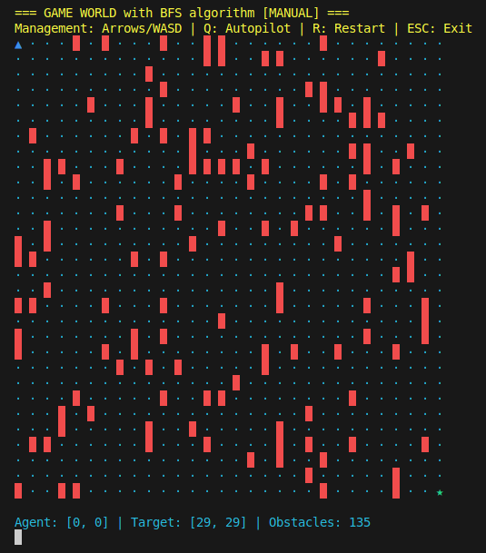

# Breadth-First Search (BFS) algorithm

Tento kód je implementácia textovej hry "GridWorld", ktorá simuluje pohyb agenta v mriežke so slučkami, prekážkami a cieľovým bodom. Tento program využíva algoritmus BFS (Breadth-First Search) na automatické hľadanie cesty medzi agentom a cieľom.

# Vyriešiť problém:

8. Breadth-First Search (BFS) algorithms

a. implementacia Breadth-First Search (BFS) algorithm v Grid world

b. najdenie trajektorie v grid world s prekážkami

# Simulácia BFS GridWorld 🎮
Príklad GridWorld

📖 Popis projektu
Toto je textová hra-simulátor "GridWorld", ktorá demonštruje fungovanie algoritmu BFS (prehľadávanie do šírky) pre hľadanie cesty v dvojrozmernej mriežke s prekážkami.

✨ Hlavné funkcie
🕹️ Hernné možnosti
🎲 Generovanie náhodného herného poľa

⚡ Dva herné režimy:

Manuálny - ovládanie agenta pomocou:

↑ ↓ ← → - pohyb

R - reštart hry

Q - ukončenie

Autopilot - automatické hľadanie cesty pomocou BFS

📊 Vizualizácia:

🔵 Agent

🟢 Cieľ

🟤 Prekážky

🟡 Navštívené políčka

🟣 Optimálna cesta

⚙️ Technické vlastnosti
🧠 Implementácia BFS algoritmu

📦 Modulárna architektúra

🖥️ Konzolové rozhranie

🛠️ Inštalácia

Naklonujte repozitár:Naklonujte repozitár:
git clone https://github.com/volodymyrseheda/bfs.git

Prejdite do priečinka projektu:
cd bfs

Spustite hru:
python3 bfs.py

Riešenie:

## 🖼️ Screenshot

# Importované knižnice

- sys a os sú : moduly na interakciu s operačným systémom, napríklad na čítanie vstupu.
- random : je použitý na generovanie náhodných prekážok.
- time : sa používa na pridanie oneskorenia (sleep).
- deque : z collections je dôležitý pre BFS (na použitie fronty).
- enum : slúži na definovanie farebných kódov pre rôzne výstupy.
- tty a termios : sa používajú na čítanie klávesových vstupov bez potreby stlačenia Enteru.

# Trieda a funkcie

### Trieda GridWorld 
-> Predstavuje mriežkový svet, v ktorom agent pohybuje vpred, prekonáva prekážky a snaží sa dostať k cieľu.
-> Táto funkcia inicializuje rozmery sveta (šírku a výšku mriežky) a nastaví hustotu prekážok.

### Funkcia reset_world:
-> Nastavuje počiatočné pozície agenta a cieľa, generuje prekážky a vyčistí všetky ďalšie premenné.

### Funkcia _generate_obstacles:
-> Táto funkcia náhodne generuje prekážky na mriežke s určitou hustotou.

### Funkcia _bfs_search:
-> Tento algoritmus hľadá cestu z počiatočnej pozície agenta do cieľa pomocou Breadth-First Search (BFS). Vytvára frontu s krokmi, ktorými sa agent môže pohybovať (hore, dole, vľavo, vpravo), a prechádza mriežku, kým nenájde cieľ.

### Funkcia start_auto_pilot:
-> Aktivuje automatický režim, kde agent bude nasledovať nájdenú cestu bez zásahu používateľa.

### Funkcia move_agent:
-> Táto funkcia pohybuje agentom buď podľa manuálneho vstupu (klávesnica) alebo automaticky, ak je zapnutý autopilot. V prípade nárazu na prekážku sa pohyb zastaví.

### Funkcia render:
-> Táto funkcia zobrazuje aktuálny stav sveta, vrátane pozícií agenta, cieľa, prekážok a navštívených miest.

### Funkcia get_key:
-> Číta klávesové vstupy od používateľa. Reaguje na klávesy pre pohyb agenta a ďalšie príkazy.

### Funkcia main:
-> main riadi celú hru, zobrazí mriežku, čaká na vstup používateľa a vykonáva pohyb agenta. Ak je zapnutý autopilot, agent sa pohybuje automaticky, inak reaguje na klávesové vstupy.

# 🏆 Príklad použitia
from gridworld import GridWorld

## Vytvorenie herného sveta
world = GridWorld(width=15, height=15, obstacle_density=0.3)

## Spustenie automatického režimu
world.start_auto_pilot()

## Hlavný herný cyklus
while True:
    world.render()
    world.move_agent()

## Vytvorenie herného sveta
world = GridWorld(width=15, height=15, obstacle_density=0.3)

## Spustenie automatického režimu
world.start_auto_pilot()

## Hlavný herný cyklus
while True:
    world.render()
    world.move_agent()

# Autori 

Bc. Volodymyr Seheda	SjF	Priemyselná mechatronika.

Bc. Maroš Drábik	    SjF	Priemyselná mechatronika.	

